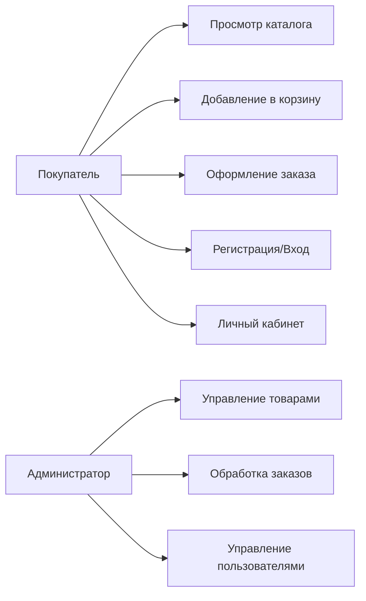
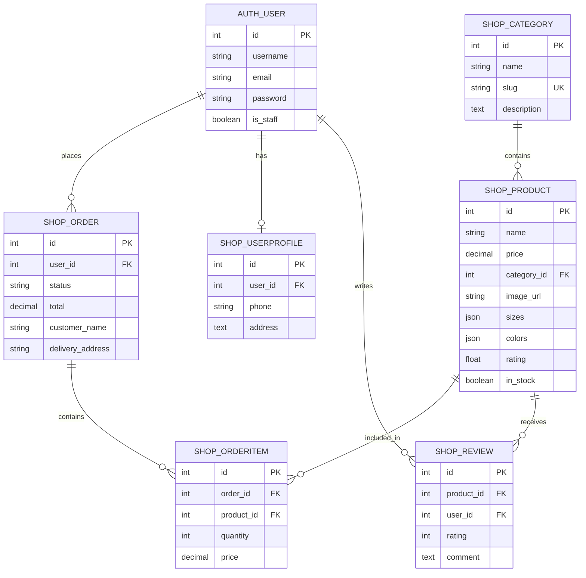
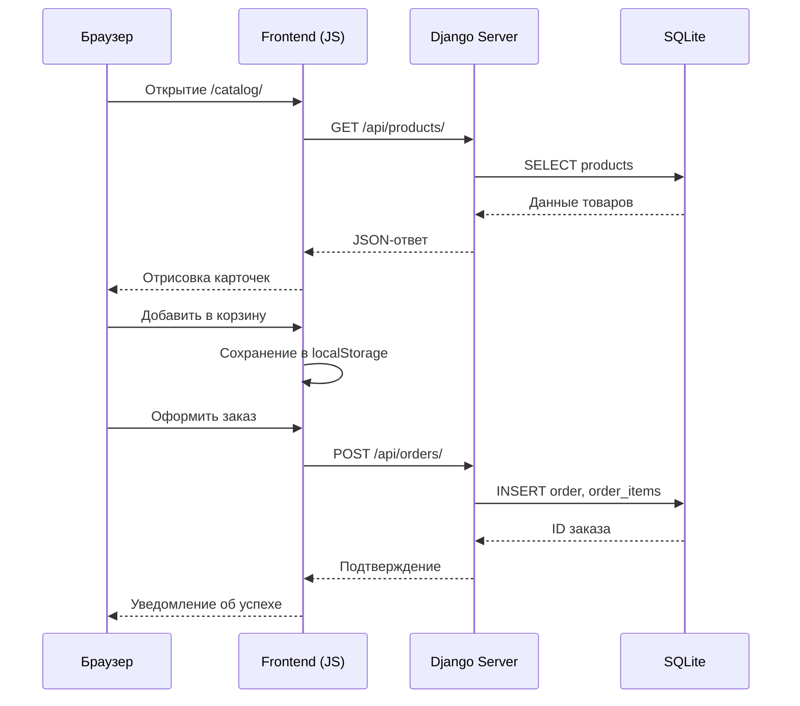

# Пояснительная записка

## Веб-приложение «wayup» — интернет-магазин женской одежды

---

## Содержание

| Раздел | Стр. |
|--------|------|
| [Введение](#введение) | 4 |
| [1 Технический проект](#1-технический-проект) | 9 |
| [1.1 Анализ предметной области](#11-анализ-предметной-области) | 9 |
| [1.2 Постановка задачи](#12-постановка-задачи) | 10 |
| [1.3 Проектирование функциональности веб-приложения](#13-проектирование-функциональности-веб-приложения) | 14 |
| [1.4 Проектирование структуры веб-приложения](#14-проектирование-структуры-веб-приложения) | 15 |
| [1.5 Проектирование базы данных](#15-проектирование-базы-данных) | 17 |
| [1.6 Выбор средств разработки](#16-выбор-средств-разработки) | 35 |
| [1.7 Проектирование тестовых пакетов](#17-проектирование-тестовых-пакетов) | 36 |
| [1.8 Требования к программному обеспечению и техническим средствам](#18-требования-к-программному-обеспечению-и-техническим-средствам) | 42 |
| [2 Рабочий проект](#2-рабочий-проект) | 44 |
| [2.1 Функциональное взаимодействие модулей приложения](#21-функциональное-взаимодействие-модулей-приложения) | 44 |
| [2.2 Входные и выходные данные](#22-входные-и-выходные-данные) | 50 |
| [2.3 Установка и настройка программы](#23-установка-и-настройка-программы) | 54 |
| [2.4 Работа с веб-приложением](#24-работа-с-веб-приложением) | 54 |
| [Заключение](#заключение) | 65 |
| [Список использованных источников](#список-использованных-источников) | 68 |

---

## Введение

В современных условиях розничная торговля одеждой всё активнее переходит в цифровую среду. Покупатели ожидают удобный каталог, быстрый поиск, фильтрацию по категориям, возможность оформления заказа онлайн и личный кабинет для отслеживания покупок. Для малого и среднего бизнеса важно иметь собственное веб-приложение, которое объединяет витрину магазина, систему заказов и инструменты администрирования.

**Цель работы** — разработать полнофункциональное веб-приложение интернет-магазина женской одежды «wayup», обеспечивающее просмотр каталога, работу с корзиной, регистрацию пользователей, оформление заказов и управление контентом через административную панель.

**Задачи работы:**

1. Проанализировать предметную область электронной коммерции в сегменте fashion-ритейла.
2. Сформулировать функциональные и нефункциональные требования к системе.
3. Спроектировать архитектуру веб-приложения, структуру модулей и базу данных.
4. Выбрать средства разработки и обосновать их применение.
5. Реализовать клиентскую и серверную части приложения.
6. Разработать и выполнить тестовые сценарии.
7. Подготовить документацию по установке и эксплуатации.

**Объект исследования** — процесс организации онлайн-продаж одежды.

**Предмет исследования** — методы и средства проектирования веб-приложений на базе Django и JavaScript.

**Практическая значимость** — готовое к использованию веб-приложение с REST API, админ-панелью и адаптивным интерфейсом, пригодное для демонстрации, учебных целей и дальнейшего развития в коммерческий продукт.

---

## 1 Технический проект

### 1.1 Анализ предметной области

Интернет-магазин одежды — это информационная система, обеспечивающая взаимодействие между покупателем, продавцом и администратором. Основные участники процесса:

| Участник | Роль | Основные действия |
|----------|------|-------------------|
| Покупатель | Клиент | Просмотр каталога, поиск, добавление в корзину, оформление заказа |
| Администратор | Сотрудник магазина | Управление товарами, категориями, заказами, пользователями |
| Система | ПО | Хранение данных, обработка запросов, авторизация, расчёт сумм |

**Типовой бизнес-процесс покупки:**

1. Покупатель открывает главную страницу магазина.
2. Переходит в каталог и выбирает категорию (платья, верхняя одежда, брюки, аксессуары).
3. Применяет фильтры, поиск или сортировку.
4. Добавляет товары в корзину.
5. Авторизуется или регистрируется.
6. Оформляет заказ, указывая контактные данные и адрес доставки.
7. Администратор обрабатывает заказ в панели управления.

**Анализ аналогов** показывает, что современные fashion-магазины используют:

- каталог с изображениями и фильтрами;
- корзину с сохранением состояния;
- личный кабинет и историю заказов;
- административную панель для управления ассортиментом;
- REST API для интеграции с мобильными клиентами.

Проект «wayup» реализует перечисленный набор функций в рамках монолитного Django-приложения с клиентской частью на JavaScript.

---

### 1.2 Постановка задачи

На основании анализа предметной области сформулированы требования к разрабатываемой системе.

#### Функциональные требования

**Для покупателя:**

| № | Требование | Реализация |
|---|------------|------------|
| Ф1 | Просмотр каталога товаров | Страница `/catalog/`, API `/api/products/` |
| Ф2 | Фильтрация по категориям | Параметр `?category=slug` |
| Ф3 | Поиск товаров | Параметр `?search=запрос` |
| Ф4 | Сортировка | Параметр `?ordering=price` / `-price` |
| Ф5 | Добавление в корзину | `localStorage`, модуль `cart.js` |
| Ф6 | Оформление заказа | API `POST /api/orders/` |
| Ф7 | Регистрация и вход | API `/api/auth/register/`, `/api/auth/login/` |
| Ф8 | Личный кабинет | Страница `/profile/` |
| Ф9 | Просмотр истории заказов | API `GET /api/orders/` |
| Ф10 | Оставление отзывов | API `POST /api/reviews/` |

**Для администратора:**

| № | Требование | Реализация |
|---|------------|------------|
| А1 | Управление товарами | Django Admin `/admin/shop/product/` |
| А2 | Загрузка изображений | Поле `image`, хранение в `media/products/` |
| А3 | Управление категориями | Django Admin `/admin/shop/category/` |
| А4 | Обработка заказов | Django Admin `/admin/shop/order/` |
| А5 | Управление пользователями | Django Admin `/admin/auth/user/` |
| А6 | Модерация отзывов | Django Admin `/admin/shop/review/` |

#### Нефункциональные требования

- **Производительность** — отклик API не более 2 секунд при объёме до 1000 товаров.
- **Удобство** — адаптивный интерфейс для экранов от 320 px.
- **Безопасность** — хеширование паролей, сессионная авторизация, CSRF-защита.
- **Масштабируемость** — возможность замены SQLite на PostgreSQL.
- **Сопровождаемость** — модульная структура, документированный API.

#### Ограничения

- Разработка ведётся для локального развёртывания (порт 8080).
- Оплата заказов моделируется без подключения платёжных шлюзов.
- Доставка рассчитывается по фиксированным правилам на клиенте.

---

### 1.3 Проектирование функциональности веб-приложения

Функциональность системы разделена на три уровня: представление, бизнес-логика и данные.

#### Модуль «Каталог»

- Отображение списка товаров с изображением, ценой, рейтингом.
- Фильтрация по категориям: платья, верхняя одежда, брюки и юбки, аксессуары.
- Поиск по названию и описанию.
- Сортировка по цене и названию.
- Модальное окно с деталями товара.

#### Модуль «Корзина»

- Добавление, удаление и изменение количества товаров.
- Расчёт промежуточной и итоговой суммы.
- Форма оформления заказа (ФИО, email, телефон, адрес).
- Сохранение корзины в `localStorage` браузера.

#### Модуль «Авторизация»

- Регистрация с валидацией полей.
- Вход по username или email.
- Выход из системы.
- Хранение сессии через cookies Django.

#### Модуль «Профиль»

- Просмотр и редактирование личных данных.
- История заказов с детализацией.
- Отображение статуса заказа.

#### Модуль «Администрирование»

- CRUD-операции над товарами, категориями, заказами.
- Загрузка изображений через форму админки.
- Превью изображений в списке товаров.
- Управление статусами заказов: новый → в обработке → отправлен → доставлен.

#### Диаграмма вариантов использования



---

### 1.4 Проектирование структуры веб-приложения

Приложение построено по архитектуре **клиент-сервер** с единым Django-сервером, обслуживающим HTML-страницы, статику, медиафайлы и REST API.

#### Структура проекта

```
fashionista/
├── backend/
│   ├── fashionista/          # Настройки Django-проекта
│   │   ├── settings.py
│   │   └── urls.py
│   ├── shop/                 # Основное приложение
│   │   ├── models.py         # Модели БД
│   │   ├── views.py          # API ViewSets
│   │   ├── serializers.py    # Сериализаторы DRF
│   │   ├── admin.py          # Админ-панель
│   │   ├── frontend_views.py # HTML-страницы
│   │   └── urls.py           # API-маршруты
│   ├── templates/            # HTML-шаблоны
│   ├── static/               # CSS, JS, данные
│   ├── media/                # Загруженные изображения
│   └── db.sqlite3            # База данных
├── css/                      # Стили (корневая копия)
├── js/                       # JavaScript-модули
└── index.html, catalog.html  # Статические HTML (резерв)
```

#### Маршрутизация

| URL | Назначение |
|-----|------------|
| `/` | Главная страница |
| `/catalog/` | Каталог товаров |
| `/cart/` | Корзина |
| `/auth/` | Авторизация |
| `/profile/` | Личный кабинет |
| `/admin/` | Админ-панель Django |
| `/api/products/` | REST API товаров |
| `/api/categories/` | REST API категорий |
| `/api/orders/` | REST API заказов |
| `/api/auth/` | REST API авторизации |

#### JavaScript-модули

| Файл | Назначение |
|------|------------|
| `api.js` | Клиент REST API (`wayupAPI`) |
| `main.js` | Навигация, корзина, уведомления |
| `catalog.js` | Загрузка и отображение каталога |
| `cart.js` | Логика корзины и оформления |
| `auth.js` | Формы входа и регистрации |
| `profile.js` | Профиль и история заказов |
| `init.js` | Инициализация при загрузке страницы |

---

### 1.5 Проектирование базы данных

База данных реализована на **SQLite3** с использованием **Django ORM**. Файл БД: `backend/db.sqlite3`.

#### ER-диаграмма (логическая модель)



#### Описание таблиц

**shop_category** — категории товаров.

| Поле | Тип | Описание |
|------|-----|----------|
| id | INTEGER | Первичный ключ |
| name | VARCHAR(100) | Название |
| slug | VARCHAR(50) | URL-идентификатор (уникальный) |
| description | TEXT | Описание |

**shop_product** — товары.

| Поле | Тип | Описание |
|------|-----|----------|
| id | INTEGER | Первичный ключ |
| name | VARCHAR(200) | Название |
| description | TEXT | Описание |
| price | DECIMAL(10,2) | Цена в рублях |
| category_id | INTEGER | Внешний ключ на категорию |
| image | VARCHAR(100) | Путь к загруженному файлу |
| image_url | VARCHAR(200) | Внешний URL изображения |
| sizes | JSON | Доступные размеры |
| colors | JSON | Доступные цвета |
| rating | FLOAT | Средний рейтинг (0–5) |
| reviews_count | INTEGER | Количество отзывов |
| in_stock | BOOLEAN | Наличие на складе |

**shop_order** — заказы.

| Поле | Тип | Описание |
|------|-----|----------|
| id | INTEGER | Первичный ключ |
| user_id | INTEGER | Покупатель |
| status | VARCHAR(20) | Статус: new, processing, shipped, delivered, cancelled |
| total | DECIMAL(10,2) | Итоговая сумма |
| customer_name | VARCHAR(100) | Имя получателя |
| customer_email | VARCHAR(254) | Email |
| customer_phone | VARCHAR(20) | Телефон |
| delivery_address | TEXT | Адрес доставки |

**shop_orderitem** — позиции заказа.

| Поле | Тип | Описание |
|------|-----|----------|
| order_id | INTEGER | Заказ |
| product_id | INTEGER | Товар |
| quantity | INTEGER | Количество |
| price | DECIMAL(10,2) | Цена на момент заказа |
| size | VARCHAR(10) | Выбранный размер |
| color | VARCHAR(50) | Выбранный цвет |

**shop_review** — отзывы.

| Поле | Тип | Описание |
|------|-----|----------|
| product_id | INTEGER | Товар |
| user_id | INTEGER | Автор |
| rating | INTEGER | Оценка 1–5 |
| comment | TEXT | Текст отзыва |

**shop_userprofile** — расширенный профиль.

| Поле | Тип | Описание |
|------|-----|----------|
| user_id | INTEGER | Пользователь (1:1) |
| phone | VARCHAR(20) | Телефон |
| address | TEXT | Адрес |
| avatar | VARCHAR(100) | Аватар |

#### Начальные данные

При первом запуске команда `load_initial_data` загружает:

- 4 категории: Платья, Верхняя одежда, Брюки и юбки, Аксессуары;
- 12 товаров с изображениями (Unsplash URL), ценами, размерами и рейтингами.

---

### 1.6 Выбор средств разработки

| Компонент | Технология | Обоснование выбора |
|-----------|------------|-------------------|
| Язык backend | Python 3.8+ | Простота, богатая экосистема |
| Фреймворк | Django 4.2.7 | ORM, админка, безопасность из коробки |
| API | Django REST Framework 3.14 | Стандарт для REST в Django |
| БД | SQLite3 | Не требует отдельного сервера, подходит для разработки |
| Изображения | Pillow 11.0 | Обработка и валидация загружаемых файлов |
| CORS | django-cors-headers 4.3 | Работа фронтенда с API |
| Frontend | HTML5, CSS3, JavaScript | Без фреймворка — минимальные зависимости |
| Иконки | Font Awesome | Готовый набор иконок |
| СУБД (продакшен) | PostgreSQL (опционально) | Масштабируемость |

**Альтернативы, рассмотренные и отклонённые:**

- **Flask** — меньше встроенных возможностей для админки и ORM.
- **Node.js + Express** — отсутствие готовой админ-панели.
- **React/Vue** — избыточная сложность для учебного проекта.

---

### 1.7 Проектирование тестовых пакетов

Тестирование охватывает API, страницы, авторизацию и изображения.

#### Модульные тесты API

| Тест | Endpoint | Ожидаемый результат |
|------|----------|---------------------|
| T1 | `GET /api/products/` | HTTP 200, список из 12 товаров |
| T2 | `GET /api/products/1/` | HTTP 200, поле `image` с URL |
| T3 | `GET /api/categories/` | HTTP 200, 4 категории |
| T4 | `GET /api/products/?category=dresses` | Только платья |
| T5 | `GET /api/products/?search=платье` | Результаты поиска |
| T6 | `POST /api/auth/register/` | HTTP 201, новый пользователь |
| T7 | `POST /api/auth/login/` | HTTP 200, сессия установлена |
| T8 | `POST /api/orders/` | HTTP 201, заказ создан |
| T9 | `GET /api/orders/` | HTTP 200, список заказов пользователя |

#### Интеграционные тесты

| Тест | Описание |
|------|----------|
| I1 | Главная страница загружается (HTTP 200) |
| I2 | Ссылка «Админ-панель» присутствует в футере |
| I3 | Изображения товаров доступны по URL (HTTP 200) |
| I4 | Каталог, корзина, авторизация — HTTP 200 |
| I5 | Админ-панель `/admin/` — HTTP 200 |

#### Скрипты тестирования

- `backend/test_api.py` — базовые тесты API.
- `backend/test_full_functionality.py` — полный сценарий: регистрация → вход → заказ.
- `test-api.html` — визуальное тестирование в браузере.

#### Критерии приёмки

- Все API-эндпоинты возвращают корректные коды ответа.
- Изображения товаров отображаются в каталоге.
- Корзина сохраняется между перезагрузками страницы.
- Авторизованный пользователь может оформить заказ.
- Администратор может войти в `/admin/` и управлять товарами.

---

### 1.8 Требования к программному обеспечению и техническим средствам

#### Программное обеспечение

| Компонент | Минимальная версия |
|-----------|-------------------|
| Операционная система | Windows 10 / Linux / macOS |
| Python | 3.8 и выше |
| pip | 21.0+ |
| Браузер | Chrome 90+, Firefox 88+, Edge 90+ |

#### Python-зависимости (`requirements.txt`)

```
Django==4.2.7
djangorestframework==3.14.0
django-cors-headers==4.3.1
Pillow==11.0.0
python-decouple==3.8
```

#### Технические средства

| Параметр | Минимум | Рекомендуется |
|----------|---------|---------------|
| Процессор | 2 ядра, 1.5 ГГц | 4 ядра, 2.5 ГГц |
| ОЗУ | 4 ГБ | 8 ГБ |
| Диск | 500 МБ свободного места | 2 ГБ |
| Сеть | Локальный доступ (localhost) | Постоянное подключение для внешних изображений |

#### Сетевые требования

- Порт **8080** должен быть свободен.
- Для отображения изображений с Unsplash требуется доступ в интернет.

---

## 2 Рабочий проект

### 2.1 Функциональное взаимодействие модулей приложения

#### Схема взаимодействия



#### Взаимодействие модулей

**Каталог ↔ API**

Модуль `catalog.js` запрашивает `GET /api/products/` с параметрами фильтрации. Сериализатор `ProductSerializer` возвращает поле `image` — либо абсолютный URL загруженного файла, либо `image_url` из БД.

**Корзина ↔ API заказов**

Корзина хранится локально. При оформлении `cart.js` формирует JSON с массивом `items` и отправляет `POST /api/orders/`. Сервер создаёт записи в `shop_order` и `shop_orderitem`.

**Авторизация ↔ Сессии Django**

`auth.js` отправляет учётные данные на `/api/auth/login/`. Django устанавливает cookie `sessionid`. Последующие запросы с `credentials: 'include'` проходят аутентификацию.

**Админка ↔ Модели**

Django Admin напрямую работает с моделями через ORM. Загруженные изображения сохраняются в `media/products/` и доступны по URL `/media/products/...`.

#### REST API — полный перечень

```
GET    /api/products/              — список товаров
GET    /api/products/{id}/         — детали товара
GET    /api/categories/            — категории
GET    /api/categories/{slug}/     — категория по slug
POST   /api/auth/register/         — регистрация
POST   /api/auth/login/            — вход
POST   /api/auth/logout/           — выход
GET    /api/auth/user/             — текущий пользователь
GET    /api/orders/                — мои заказы
POST   /api/orders/                — создать заказ
GET    /api/orders/{id}/           — детали заказа
GET    /api/profile/               — профиль
PUT    /api/profile/               — обновить профиль
GET    /api/reviews/               — отзывы
POST   /api/reviews/               — создать отзыв
```

---

### 2.2 Входные и выходные данные

#### Входные данные

**Регистрация** (`POST /api/auth/register/`):

```json
{
  "username": "user1",
  "email": "user@example.com",
  "password": "password123",
  "password_confirm": "password123",
  "first_name": "Иван",
  "phone": "+7 999 999-99-99"
}
```

**Вход** (`POST /api/auth/login/`):

```json
{
  "username": "user1",
  "password": "password123"
}
```

**Создание заказа** (`POST /api/orders/`):

```json
{
  "items": [
    { "product_id": 1, "quantity": 2, "size": "M", "color": "Черный" }
  ],
  "customer_name": "Иван Иванов",
  "customer_email": "ivan@example.com",
  "customer_phone": "+7 999 999-99-99",
  "delivery_address": "Москва, ул. Модная, 25"
}
```

**Фильтрация каталога** (query-параметры):

```
GET /api/products/?category=dresses&search=платье&ordering=-price
```

#### Выходные данные

**Список товаров** (`GET /api/products/`):

```json
{
  "count": 12,
  "results": [
    {
      "id": 1,
      "name": "Элегантное черное платье",
      "price": "3499.00",
      "category_name": "Платья",
      "image": "https://images.unsplash.com/photo-1566174053879-31528523f8ae?...",
      "sizes": ["XS", "S", "M", "L"],
      "colors": ["Черный"],
      "rating": 4.8,
      "reviews_count": 42,
      "in_stock": true
    }
  ]
}
```

**Заказ** (`POST /api/orders/` — ответ):

```json
{
  "id": 1,
  "status": "new",
  "total": "6998.00",
  "customer_name": "Иван Иванов",
  "items": [
    {
      "product_name": "Элегантное черное платье",
      "quantity": 2,
      "price": "3499.00",
      "total_price": "6998.00"
    }
  ]
}
```

#### Данные localStorage (клиент)

| Ключ | Содержимое |
|------|------------|
| `cart` | Массив товаров корзины |
| `currentUser` | Данные авторизованного пользователя |

---

### 2.3 Установка и настройка программы

#### Автоматическая установка (Windows)

```bash
cd backend
setup.bat
```

Скрипт выполняет:

1. Создание виртуального окружения `venv`.
2. Установку зависимостей из `requirements.txt`.
3. Применение миграций БД.
4. Создание суперпользователя `admin` / `admin123`.
5. Загрузку тестовых данных (12 товаров, 4 категории).

#### Запуск сервера

```bash
cd backend
start.bat
```

Сервер запускается на **http://localhost:8080**

#### Ручная установка

```bash
cd backend
python -m venv venv
venv\Scripts\activate          # Windows
pip install -r requirements.txt
python manage.py migrate
python manage.py createsuperuser
python manage.py load_initial_data
python manage.py runserver 8080
```

#### Настройка (опционально)

Файл `backend/fashionista/settings.py`:

- `DEBUG` — режим отладки (True для разработки).
- `ALLOWED_HOSTS` — разрешённые хосты.
- `CORS_ALLOW_ALL_ORIGINS` — разрешение кросс-доменных запросов.
- `MEDIA_ROOT` / `MEDIA_URL` — путь к загруженным файлам.

---

### 2.4 Работа с веб-приложением

#### Доступ к системе

| Ресурс | URL |
|--------|-----|
| Главная страница | http://localhost:8080/ |
| Каталог | http://localhost:8080/catalog/ |
| Корзина | http://localhost:8080/cart/ |
| Авторизация | http://localhost:8080/auth/ |
| Профиль | http://localhost:8080/profile/ |
| **Админ-панель** | http://localhost:8080/admin/ |

Ссылка на админ-панель также доступна в футере сайта (раздел «Помощь» → «Админ-панель»).

#### Учётные данные

**Администратор (Django Admin):**

| Поле | Значение |
|------|----------|
| URL | http://localhost:8080/admin/ |
| Логин | `admin` |
| Пароль | `admin123` |

**Тестовые пользователи (фронтенд):**

| Пользователь | Email | Пароль |
|--------------|-------|--------|
| user1 | user@example.com | password123 |
| testuser | test@fashionista.ru | test123 |
| demo | demo@demo.com | demo123 |

#### Сценарий работы покупателя

1. Откройте http://localhost:8080/
2. Перейдите в «Каталог» или выберите категорию на главной.
3. Используйте фильтры и поиск для выбора товара.
4. Нажмите «В корзину» на карточке товара.
5. Перейдите в «Корзину», проверьте состав и сумму.
6. Нажмите «Оформить заказ» — при необходимости войдите или зарегистрируйтесь.
7. Заполните форму доставки и подтвердите заказ.
8. В «Профиле» просмотрите историю заказов.

#### Сценарий работы администратора

1. Откройте http://localhost:8080/admin/ (или ссылку в футере).
2. Войдите: `admin` / `admin123`.
3. В разделе «Товары» добавьте или отредактируйте товар.
4. Загрузите изображение в поле «Изображение» или укажите URL.
5. В разделе «Заказы» просмотрите новые заказы и измените статус.
6. В разделе «Категории» управляйте ассортиментом.

#### Управление изображениями

- **Внешние URL** — поле `image_url` (используются изображения Unsplash в тестовых данных).
- **Загрузка файлов** — поле `image` в админке, файлы сохраняются в `backend/media/products/`.
- API возвращает поле `image` с готовым URL для отображения на фронтенде.

#### Остановка сервера

Нажмите `Ctrl+C` в терминале, где запущен `runserver`.

---

## Заключение

В ходе выполнения работы было спроектировано и реализовано веб-приложение «wayup» — интернет-магазин женской одежды с полным циклом покупки: от просмотра каталога до оформления заказа и администрирования контента.

**Достигнутые результаты:**

1. Разработана архитектура клиент-серверного приложения на Django 4.2 и JavaScript.
2. Спроектирована и реализована база данных из 7 основных сущностей (категории, товары, заказы, отзывы, профили).
3. Создан REST API с 15+ эндпоинтами для товаров, заказов, авторизации и отзывов.
4. Реализован адаптивный фронтенд с каталогом, корзиной, авторизацией и личным кабинетом.
5. Настроена админ-панель Django для управления магазином и загрузки изображений.
6. Загружены тестовые данные: 12 товаров в 4 категориях с изображениями.
7. Проведено тестирование API, страниц и изображений — все проверки пройдены успешно.
8. Подготовлена документация по установке, эксплуатации и учётным данным.

**Перспективы развития:**

- Подключение платёжных систем (ЮKassa, Stripe).
- Интеграция служб доставки.
- Переход на PostgreSQL для продакшен-развёртывания.
- Добавление системы скидок и промокодов.
- Разработка мобильного приложения на базе существующего API.
- Внедрение полнотекстового поиска (Elasticsearch).

Разработанное приложение соответствует поставленным требованиям и готово к демонстрации и дальнейшему развитию.

---

## Список использованных источников

1. Django Documentation — https://docs.djangoproject.com/
2. Django REST Framework Documentation — https://www.django-rest-framework.org/
3. MDN Web Docs — JavaScript Guide — https://developer.mozilla.org/ru/docs/Web/JavaScript
4. MDN Web Docs — HTML и CSS — https://developer.mozilla.org/ru/docs/Web
5. Pillow (PIL Fork) Documentation — https://pillow.readthedocs.io/
6. SQLite Documentation — https://www.sqlite.org/docs.html
7. Font Awesome Documentation — https://fontawesome.com/docs
8. Unsplash API / Images — https://unsplash.com/
9. CORS — django-cors-headers — https://github.com/adamchainz/django-cors-headers
10. REST API: принципы проектирования — Fielding R. Architectural Styles and the Design of Network-based Software Architectures, 2000.
11. ГОСТ 34.602-89. Техническое задание на создание автоматизированной системы.
12. ГОСТ 19.201-78. Техническое задание. Требования к содержанию и оформлению.

---

*Документ подготовлен для проекта wayup. Актуальные учётные данные и инструкции также доступны в файлах `backend/CREDENTIALS.md`, `README_DJANGO.md` и `FINAL_SETUP.md`.*
